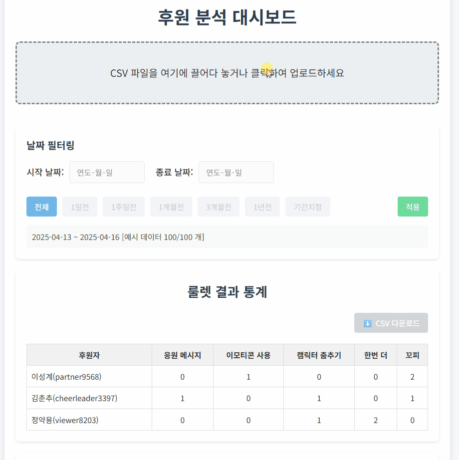

# SOOP 룰렛 분석기 (SOOP Roulette Analyzer)

[ 바로가기](https://soopatree.github.io/index.html)

룰렛 분석기는 스트리밍 플랫폼의 후원 데이터를 분석하고 시각화하는 대시보드 웹 애플리케이션입니다. 별풍선 CSV 파일을 업로드하여 후원자 순위와 룰렛 결과 통계를 한눈에 확인할 수 있습니다.

## 주요 기능

- **드래그 앤 드롭 파일 업로드**: 간편한 CSV 파일 업로드 기능
- **후원 순위 표시**: 후원 개수 기준으로 정렬된 후원자 목록 제공
- **룰렛 결과 통계**: 후원자별 룰렛 결과 분석 및 시각화
- **날짜 필터링**: 다양한 기간 설정으로 원하는 기간의 데이터만 분석 가능
  - 1일, 1주일, 1개월, 3개월, 1년 단위 필터 지원
  - 사용자 정의 기간 설정 가능
- **CSV 내보내기**: 분석 결과를 CSV 파일로 다운로드
- **드래그 앤 드롭 컬럼 재정렬**: 룰렛 결과 컬럼을 원하는 순서로 재배치 가능

## 사용 방법

1. 웹 페이지에 접속합니다
2. CSV 파일을 드래그 앤 드롭으로 업로드하거나 파일 선택 영역을 클릭하여 파일을 선택합니다
3. 날짜 필터를 사용하여 원하는 기간의 데이터를 필터링합니다
4. 후원 순위와 룰렛 결과 통계를 확인합니다
5. 필요한 경우 CSV 다운로드 버튼을 사용하여 결과를 다운로드합니다

## 라이센스

MIT License

## 기여하기

1. 이 저장소를 포크합니다
2. 새 브랜치를 만듭니다 (`git checkout -b feature/amazing-feature`)
3. 변경사항을 커밋합니다 (`git commit -m 'Add some amazing feature'`)
4. 브랜치에 푸시합니다 (`git push origin feature/amazing-feature`)
5. Pull Request를 생성합니다
